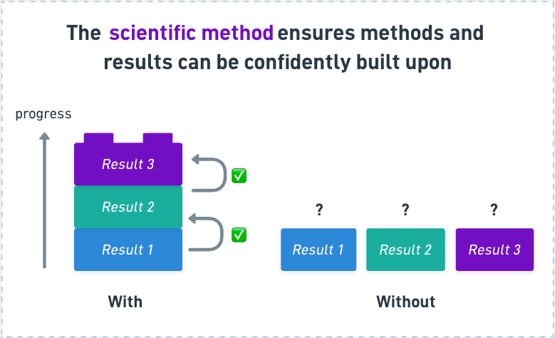
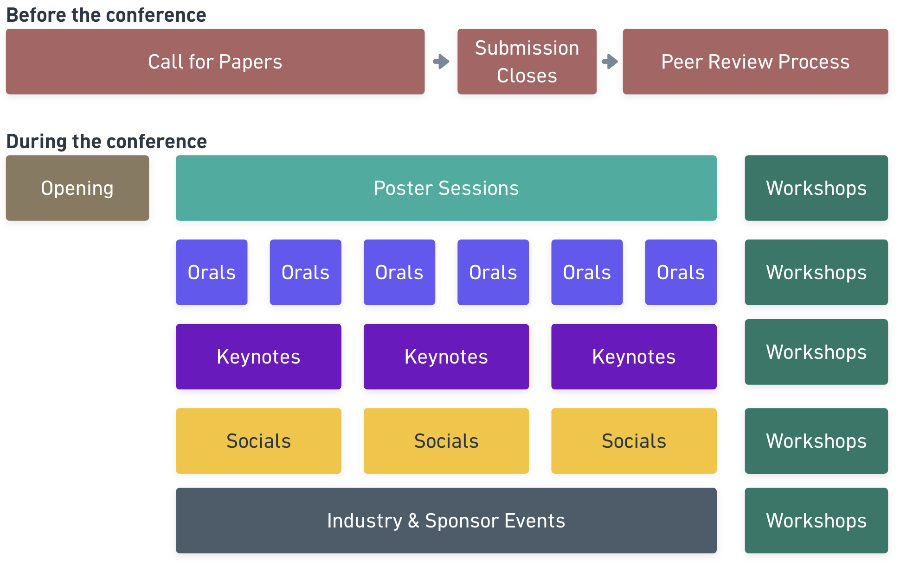
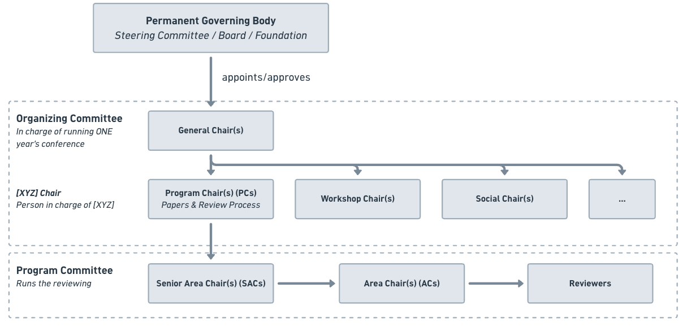

# 1.1 An Introduction to AI Conferences

## Introduction

**How do you keep track of the understanding of an entire scientific field across space and time?**

There are many ways to share your work, such as via presentations, blog posts, and social media. But to have your work *published* should mean that it passes a higher bar than a simple blog post. Namely, your work should follow the scientific method such that any claimed results actually advance the understanding of the field. 

The rigor of the process (e.g. through hypothesis testing and expert peer review) is what allows us to confidently build on past work without reinventing the wheel each time.

{#scientific-method width=100% fig-align="center"}

Journals are the traditional way for researchers to share scientific knowledge (with notable examples including *Nature* and *Science*).

These documents, known as *papers*, describe in detail what question(s) the researchers explored, their hypotheses, what data and methods they used, what results they got, and a discussion about their work and how it fits into the general field. Thus, journal papers are ways to document the progress in the field.

**However, the field of Computer Science publishes research papers through *conferences*, with *conference proceedings* being as prestigeful as journals are in other domains (such as physics and environmental science) [@vardi_2009].**

The submissions to AI conferences have exploded over the past years as interest in AI and ML have skyrocketed, as seen below.

<iframe title="ML conference submissions grew more than tenfold in a decade" aria-label="Line chart" id="datawrapper-chart-So9or" src="https://datawrapper.dwcdn.net/So9or/1/" scrolling="no" frameborder="0" style="width: 0; min-width: 100% !important; border: none;" height="463" data-external="1"></iframe>

**Since AI conferences are one of the main ways for AI researchers to distribute their research, meet others, and get opportunities in the field, it is crucial to understand how they work, what there is to learn from them, and how you can participate yourself.**

These topics are exactly what we will cover in the next few modules.

## Why AI conferences?

> TL;DR: An AI conference is a gathering of AI researchers where they can share and get feedback on their work, learn from their peers, and find new collaborators and opportunities.

There are many reasons why conferences are valuable for the scientific community [@global_conference_2024] and are especially important for the AI community.

- **Exchange Knowledge**: Conferences are ways to both *present* and get *feedback* on your own work, and learn from other people's work. The Conference Proceedings act as a summary of the progress in the field and is a way to disseminate the research to a broad audience. Many conferences also include dedicated tutorial sessions and learning events for participants to pick up new skills.
- **Find Collaborator and Community**: Conferences are landmark annual events that many people attend *in person*. Gathering many people from all over the world in the same place is thought to foster new collaborations, seed new ideas, and discover topics you didn't knew existed before. Face-to-face interactions are also incredibly important to build relationships and community. There are often many socials surrounding the conference days for people to meet new people.
- **Get Opportunities**: Getting published in conferences is often important to get both academic and industry positions. Most conferences also have extensive sponsor presence with recruiters, industry events, and opportunities just for participants.

::: {.callout-note}
One reason why computer science prefers AI conferences over journals is because of their faster publish cycles. However, due to the fast pace of the field, even conferences have become too slow to accurately communicate the latest results. However, conferences still serve as important events due to their many other purposes. We explore this and other limitations of AI conferences in the last module.
:::

For young researchers, conferences are often how to get the foot through the door into the world of AI research.

## Major AI conferences

Below is a table of some of the major *general* AI conferences to follow, but note that there may be more specialized and relevant conferences for your domain (such as MICCAI for computational imaging). We go more into detail in how to find and choose a venue in the next module.

| Name | What the name means | Focus | Link |
|------|---------------------|-------|------|
| NeurIPS | Conference on Neural Information Processing Systems | General ML/AI, with strong roots in neural networks | [nips.cc](https://nips.cc) |
| ICML | International Conference on Machine Learning | Core ML theory, optimization, algorithms | [icml.cc](https://icml.cc) |
| ICLR | International Conference on Learning Representations | Deep learning / representation learning | [iclr.cc](https://iclr.cc) |
| CVPR | Conference on Computer Vision and Pattern Recognition (IEEE/CVF) | Computer vision | [cvpr.thecvf.com](https://cvpr.thecvf.com) |
| AAAI | Association for the Advancement of Artificial Intelligence | General AI, more applications-oriented | [aaai.org](https://aaai.org) |
| ACL | Annual Meeting of the Association for Computational Linguistics | Natural language processing | [aclweb.org](https://www.aclweb.org) |

Each conference is usually hosted on an annual basis with a new location every year. Their deadlines to submit a paper are spread throughout the year, so you often always have a future conference coming up!

## The anatomy of an AI conference

Although each conference is unique, they usually follow a similar structure.

*Before the conference:*

- **Call for Papers**: a period in which researchers can submit their papers.
- **Review Process**: papers are reviewed and scored, often giving authors a chance to respond (*rebuttal*).

*During the conference:*

The conference days themselves usually include the following parts:

- **Opening Ceremony**: introductions, an overview of the organizational structure, statistics, a welcome, often an artistic event, and award ceremony.
- **Keynotes**: invited talks by major researchers in the field.
- **Poster Sessions**: the main event, run like a science-fair to share knowledge and get feedback. Authors are assigned a location and time to put up their poster, and all accepted papers get a poster slot.
- **Oral Sessions**: spotlight talks by authors of selected papers.
- **Sponsor Booths and Expos**: industry events, talks, and recruitment.
- **Socials**: gatherings for specialized groups (for instance, women in CS or people in computational biology), mentorship sessions, and evening dinners and activities.
- **Tutorials**: skill-building sessions.
- **Workshops**: specialized sessions held directly before or after the main conference. They act like mini sub-conferences, with their own paper submission tracks, peer review, and poster sessions, and usually run for a day or half-day.

{#conferences-structure width=100% fig-align="center"}

Below is a video from ICLR 2026 giving you a taste of how an actual AI conference looks like! 



## How are AI conferences organized?

The amazing thing is, AI conferences are run by **volunteers from the research community itself**.

{#organizational-structure width=100% fig-align="center"}

The structure can be roughly split into three layers:

- **Permanent Governing Body** (Steering Committee / Board / Foundation): the long-lived organization that persists across years. It appoints and approves the team that runs each individual edition of the conference.

- **Organizing Committee**: in charge of running *one* year's conference.
  - **General Chair(s)**: lead the whole event and oversee the other chairs.
  - **Program Chair(s) (PCs)**: responsible for the papers and review process.
  - **Workshop Chair(s)**: responsible for the workshops.
  - **Social Chair(s)**: responsible for the social events.
  - *...and other "[XYZ] Chairs"*: each is the person in charge of [XYZ], following the same naming pattern.

- **Program Committee**: runs the actual reviewing, in a chain of decreasing scope.
  - **Senior Area Chair(s) (SACs)**: oversee a broad area and coordinate the Area Chairs under them.
  - **Area Chair(s) (ACs)**: manage a narrower topic area and the reviewers within it.
  - **Reviewers**: read and score the submitted papers.

::: {.callout-note}
If this seems like a lot of work to do for free outside of your regular (alread full-time) job, it is because it really is! 

The entire system runs on the volunteering work of the research community. Therefore, it is AI research etiquette that if you submit a paper, you also volunteer to review a paper. In practice, many large conferences now formalize this expectation: authors may be *required* to register as reviewers, and failing to deliver reviews can result in your own paper being penalized or desk-rejected.
:::

## Conclusion

- **AI research is published through conferences, not journals.** Unlike most scientific fields, computer science publishes its peer-reviewed work primarily through conferences rather than journals, where the proceedings carry the same prestige.

- **They are about far more than papers.** A conference is a gathering where researchers exchange knowledge, find collaborators and community through in-person interaction, and access career opportunities.

- **The whole system is run by the community, for the community.** From the governing body down to individual reviewers, conferences depend on the volunteer labor of researchers themselves. Participating, including submitting papers yourself and giving back through reviewing, is how you become part of the field.