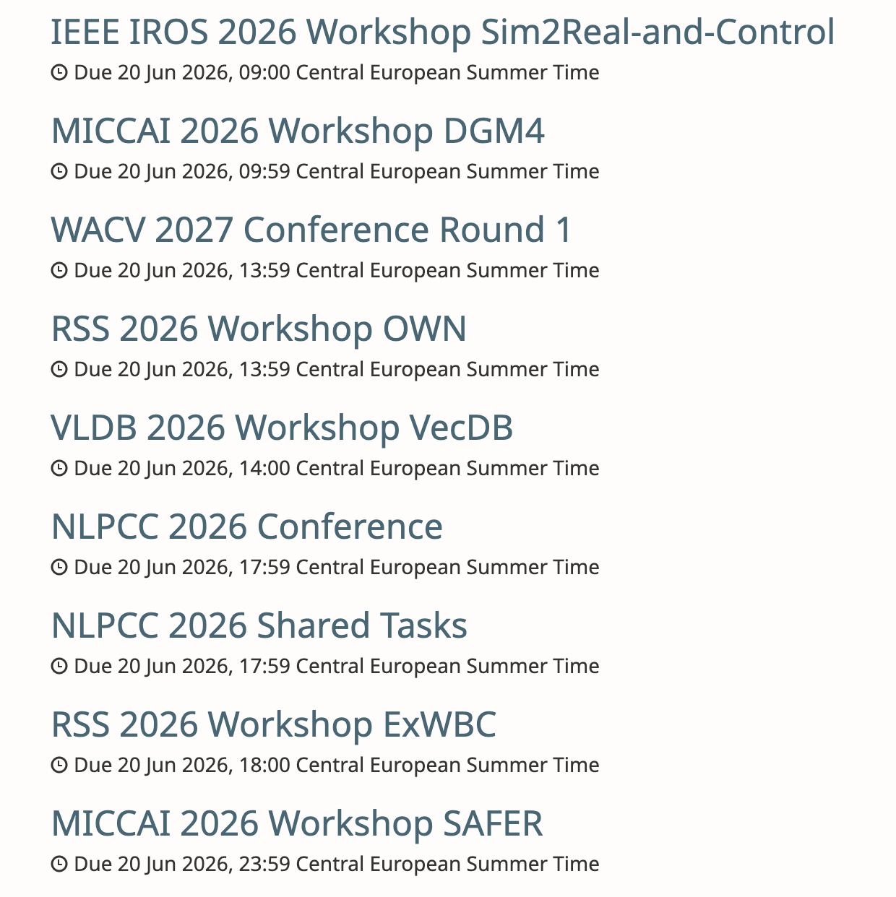
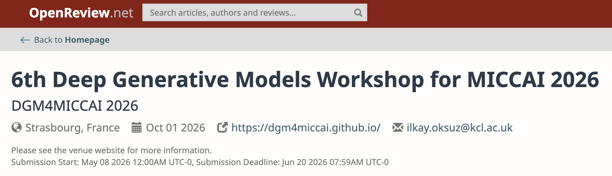
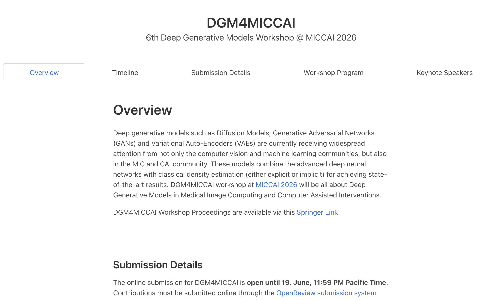
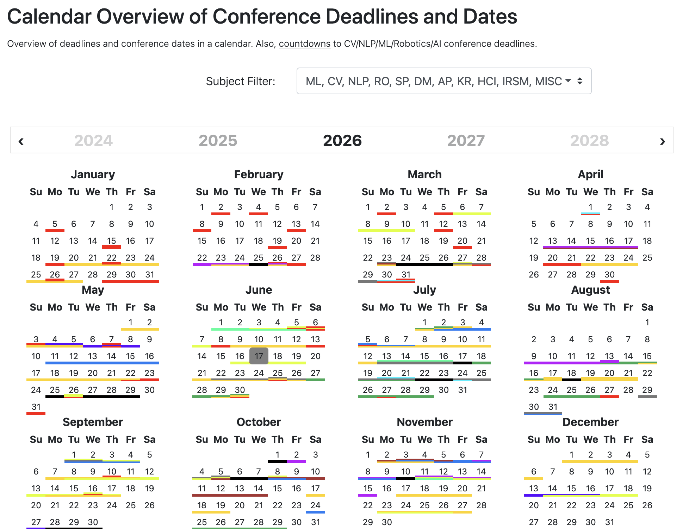

# Module 2 — Choosing a Venue

## Introduction

Now that you know what conferences are and why they are important, how do you actually go about finding and choosing between them so that you can participate? 

There are multiple platforms to do so, which we'll cover next.

## How to find upcoming conferences

### [OpenReview](https://openreview.net/)

The main website I like to use to find conferences is [**OpenReview**](https://openreview.net/). 

OpenReview is an open platform that a lot of the science community uses to handle the entire paper submission and review process. It has a listing of upcoming submission deadlines for various conferences and their different tracks. It's worth realizing that there are different types of submissions. The structure is usually: a main conference, plus specialized workshops and tutorials. Open Review lists all of these (both the main conferences and the workshops and tutorials within specific tracks) for the conferences that use the OpenReview system.

{#openreview-listing width=100% fig-align="center"}

For each entry you can see the title of the conference or track, the deadline for submitting a paper, a short summary of what the track is about, and a link to the official conference page.

{#openreview-details width=100% fig-align="center"}

{#openreview-workshop-example width=100% fig-align="center"}

**As a first-time researcher, this listing is a really nice way to get a sense of the different topics that are possible or already being discussed.**

What I like to do for my first pass is just browse the listing, open the links that sound interesting, and figure out why they draw my interest. Take note of what you respond to. Then you can use that as inspiration for your current or next project.

::: {.callout-note}
One thing to keep in mind: the OpenReview listing is sorted by **closest upcoming deadline** by default. That means most of what you'll see first has a very tight turnaround, which is hard if you're starting a project from scratch. You may have to pick something at least a few weeks or months ahead so that you have time to do the project properly and submit it.
:::

### Official websites and ML deadline calendars

The established machine learning conferences follow a fairly predictable schedule, so you can check back at their websites at regular intervals.

Sites like *ML Deadlines* or *AI Deadlines* show when the major conferences have their paper deadlines and when they actually run. On the official conference pages you'll also find the workshops, and from there you can look at each individual workshop.

{#ai-deadlines width=100% fig-align="center"}

::: {.callout-note}
Note that for large conferences, the main track has a single deadline, but the **deadlines for the individual workshops and tutorials can vary**. Therefore, it is important to go into the official site and check the specific deadline.
:::

Below is a table with some of the major recurring AI conferences and workshop series to keep an eye on.

| Acronym | Full Name | Topic Area / Focus | Conf. Dates | Main Paper Deadline | Workshop / Tutorial Deadline |
|---|---|---|---|---|---|
| **[NeurIPS](https://neurips.cc/)** | Neural Information Processing Systems | General ML, deep learning, neuroscience, statistics, optimization | December | ~Mid May | ~Aug–Sep |
| **[ICML](https://icml.cc/)** | International Conference on Machine Learning | Core ML theory & practice, learning algorithms, broad applications | July | ~Late January | ~Late April |
| **[ICLR](https://iclr.cc/)** | International Conference on Learning Representations | Deep learning, representation learning | April–May | ~Late September | ~Late Jan–Early Feb |
| **[AAAI](https://aaai.org/conference/aaai/)** | AAAI Conference on Artificial Intelligence | Broad AI: search, planning, knowledge representation, ML, NLP, robotics | January | ~Late Jul–Early Aug | ~Early November |
| **[MICCAI](https://miccai.org/)** | Medical Image Computing and Computer Assisted Intervention | Medical imaging, surgical AI, image-guided interventions, clinical computing; since 1998 | Sep–Oct | ~April | ~June |
| **[MLHC](https://mlhc.org/)** | Machine Learning for Healthcare | ML for clinical medicine, EHR, biomedical data, health outcomes; strong translational focus; since 2016 | August | ~Mid April | N/A, no separate workshop track |
| **[ML4H](https://ahli.cc/ml4h/)** | Machine Learning for Health Symposium (AHLI) | ML for healthcare, biomedicine, public health; Proceedings & Findings tracks | December | ~Early September | N/A, standalone symposium; no workshop sub-track |
| **[CCAI](https://www.climatechange.ai/)** | Tackling Climate Change with ML (Climate Change AI) | ML for climate modeling, clean energy, agriculture, adaptation & policy; recurring workshop series at NeurIPS & ICML since 2019 | Dec (NeurIPS) + Jul (ICML) | ~Aug (NeurIPS workshop) / ~Apr (ICML workshop) | N/A, CCAI is itself a host of recurring workshops; not a standalone conference |
| **[EDM](https://educationaldatamining.org/conferences/)** | Educational Data Mining | Data mining & ML for education, learning analytics, intelligent tutoring, adaptive ed-tech; since 2008 | June–July | ~Early February | ~March |

::: {.callout-note}
The listed deadlines are *typical annual patterns*. Exact dates shift each year, so always verify on official conference websites. "Workshop deadline" = paper submissions *to* workshops, not workshop *proposal* deadlines. CCAI is a recurring workshop series co-located with NeurIPS/ICML, not a standalone conference.
:::

### Social media and Forums

Another great resource is social media. 

The tactic is to **follow a few key people in the field**, since they often **curate and repost key opportunities**. This is especially good for hearing about new conferences early, and for finding smaller venues that may be more relevant to your specific niche. A lot of researchers are active on X, LinkedIn, and Bluesky. (Bluesky also offers starter packs for some research communities).

Some AI communities also have dedicated Discord servers, Slack channels, or community platforms where members regularly post upcoming opportunities and even open calls for collaborations. 

Some examples include:

- **[AI for Conservation Slack](https://beerys.github.io/#slack)**: Started by Sara Beery, an "interdisciplinary space for researchers who work across the fields of computer vision, machine learning, and AI for conservation and sustainability applications to share opportunities, discuss best practices, and find collaborators." 

- **[Climate Change AI Community Platform](https://community.climatechange.ai/)**: A dedicated community platform for people to "connect, share and discuss all things related to climate change & machine learning."

- **[Fast AI Discord](https://forums.fast.ai/t/fast-ai-discord/122404)**: Started by Jeremy Howard, Fast.ai is both a crash course in and a supportive forum for all things deep learning.

Checking these forums is a good way to see what's coming up, and especially for students, there are often special tracks and volunteering calls.

### Previous papers (e.g. via Google Scholar and arXiv)

If you find articles or papers that you really like, a lot of them were first published at a conference. 

So looking at where a paper you admire was published is another way to discover venues relevant to your interests. You can use **[arXiv](https://arxiv.org/)** or **[Google Scholar](https://scholar.google.com/)** to find papers you find interesting, then look at the metadata or venue field to see where they were published. 

.](../assets/images/sasha-google-scholar-listing.png){#google-scholar-sasha width=100% fig-align="center"}

Starting with what caught your interest and working backwards often points you straight to the conference you should follow more closely!

### Search and your network

Finally, a simple Google search or a deep-research query from your favorite LLM tool can help uncover more opportunities. If you use these, just make sure you're looking at the **current edition of the event** and that it hasn't already happened: you don't want to build a project for a conference that's already in the past. 

And don't forget your network: if you're at a university, your faculty, peers, and professors can often point you toward conferences worth pursuing.

### What if the right conference doesn't exist?

**Don't be discouraged if you can't find your conference.** 

If you feel like there's a workshop that *should* exist but doesn't, that doesn't mean you can't pursue the project you want to. In the final module we will cover how to help organize a workshop yourself. And rest assured that these workshops come around with incredible speed, so you can also do the project, keep it on hold, and submit when the right opportunity comes up.

## How to choose a conference

When you first see the listings, you may want to apply to them all! 

Roughly speaking, there are two schools of thought when approaching picking a conference: 

1. **Work first, venue second**: Some people do the *work first*, oblivious to upcoming deadlines, and then (once they have a finished or at least have a working project) actively search for conferences that line up with the project's scope and mission. 

2. **Venue first, work second**: Others use conferences as a way to get *inspiration* to even start a project: maybe a workshop's topic is something you'd never thought about before, and that prompts you to do a whole project and submit to it.

For first-time researchers it may often be more of the latter, since you might not have a clear project in mind yet and are using conferences and workshops as inspiration for the kind of AI research you could do. But most likely you already have some interest in a particular area, which will narrow the scope for you.

Another consideration is the **submission type** and which tracks are offered by different venues.

There are two main types of submissions:

| Track | Description | Pros | Cons |
|---|---|---|---|
| **Main conference** | Full-length peer-reviewed research papers submitted to the primary track. Accepted papers are published in official archival proceedings and indexed for citation. The most competitive and most prestigious submission type at any venue. | Highest prestige and often results in a citable (archival) publication. | Low acceptance rates (typically 15–30% at top venues); long review cycles (3–6 months from submission to decision); one submission window per year per conference; strict page limits and formatting requirements. |
| **Workshop** | Shorter papers, extended abstracts, or position papers on a focused or emerging topic, co-located with a main conference. Organised by the community around a specific subfield or cross-disciplinary theme. | More accessible entry point; suitable for early-stage, speculative, or negative-results work; faster review turnaround; excellent for community building within a subfield; can gain visibility at top conferences without competing in the main track. | Usually not formally citable (non-archival); prestige and review rigour vary widely across workshops; shorter format limits methodological depth; weighted less in academic evaluation than main-track papers. |

Some might want to target the **main conference papers** due to its prestige and larger visibility (if accepted) in the ML community, but others may value **workshop papers** higher due to the increased relevance of engaging directly with a specialized community within the larger ML domain.

## Student and first-time researcher strategies

For students specifically, there are a bunch of initiatives that go beyond a standard main-track
paper. 

We especially recommend **workshop papers** and, increasingly, **tiny papers** (a mini-paper format
many conferences have introduced to lower the threshold for early-career researchers to get feedback on their work). These are a wonderful way to get your foot in the door as a student and first-time researcher: the scope is smaller, the results don't have to be fully final, and you still get to experience the full peer-review process, do some initial work, and get feedback on it.

Also, even if you don't get a paper accepted, you can still often attend by **volunteering** at the venue!