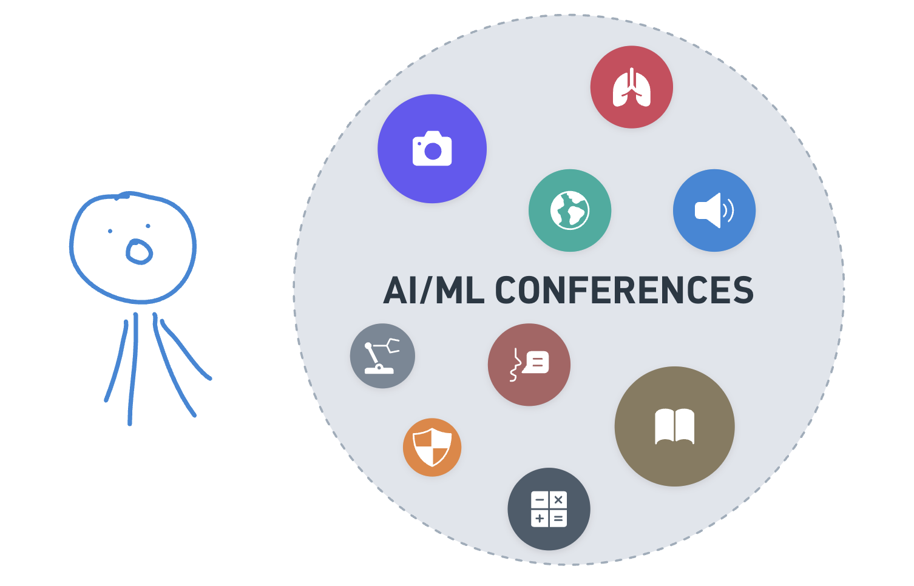
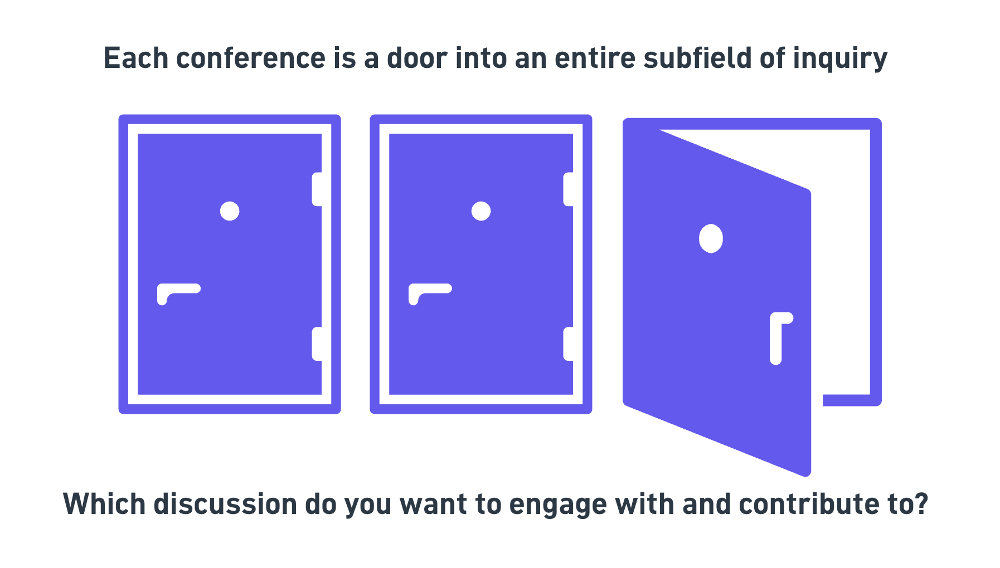
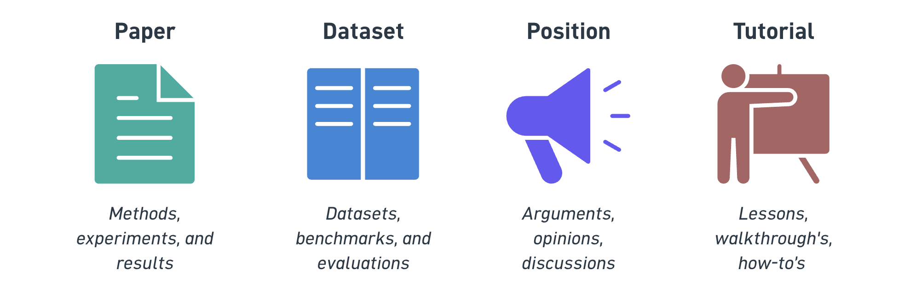

# Module 2 — Choosing a Venue

Now that you know what conferences are and why they are important, how do you actually go about finding and choosing between them so that you can participate?

Before we get to the *how*, it's worth stepping back to remember what a conference really is. **Conferences are the public, living records of progress in a field and of the subfields within it.** From a distance, we often only hear about the milestones of all the experimentation: the latest model release, a new benchmark topped, a headline result. But behind each milestones is an enormous amount of discussion, iteration, and work happening within the community.

{#conference-bubbles width=100% fig-align="center"}

Seen this way, finding a conference is as much about finding the people who share your problem and domain, and using the conference as a medium to add your voice and contributions to the living progress of the field.

{#conference-door width=100% fig-align="center"}

## Types of conferences

There are a huge number of conferences out there, and it helps to place them along a few different **verticals** rather than treating them as one big ranked list. You'll find plenty of rankings online, but most of them sort venues purely by **citations**. That's a useful signal, but it's only one dimension. A few of the variables worth thinking about:

| Vertical | The question it answers | Ranges from… |
|---|---|---|
| **Scope** | What topics does it cover? | Broad, generalist venues → narrow, specialized ones |
| **Size** | How many people take part? | Thousands of participants → a few hundred or fewer |
| **Prestige/impact** | How widely is the work read and cited? | Niche and emerging → widely cited |

**Scope: broad or narrow.** Generalist venues like **ICLR** and **ICML** span the whole field, with many specialized sessions, tracks, and workshops nested inside them. Specialized venues instead focus on a single topic, such as computer vision, healthcare, education, or ML theory. The line between the two is fluid: a specialized session can grow so popular that it spins out into its own dedicated conference, and, going the other way, many specialized communities live on as workshops or tracks *within* a larger conference rather than as standalone events.

**Size: thousands or hundreds.** Some venues, like **NeurIPS**, draw many thousands of participants, while others are intimate gatherings of a few hundred (or fewer). Bigger isn't automatically better: a smaller venue can mean more focused conversations and easier access to the specific people whose work you care about.

**Prestige/impact: citations.** This is what most online rankings try to capture, usually through citation-based metrics such as an impact factor or [Google Scholar's h5-index](https://scholar.google.com/citations?view_op=top_venues&hl=en). It's worth appreciating just how high the top ML venues now sit on these scales.

::: {.callout-note}
As of July 2026, the computer vision conference **CVPR ranked #2 among *all* publications across every field of science**, behind only *Nature*, and ahead of *Science*, the *New England Journal of Medicine*, and *JAMA*. NeurIPS (#7) and ICLR (#8) also placed in the top ten.
:::

A quick word of caution: citations and prestige are only one vertical. As a first-time researcher, **fit** (a venue whose scope matches your work) and **community** (a size and crowd you can actually engage with) often matter far more than a venue's raw ranking.

## Submission types

{#conferences-submission-types width=100% fig-align="center"}

Another great thing to get familiar with is the **submission type**, and which tracks a venue offers.

There are several types of submissions. Beyond the two most common ones (main conference and workshop papers), many venues also run dedicated tracks such as a datasets & benchmarks track and a position paper track (ICML, for example, runs both):

| Track | Description | Pros | Cons |
|---|---|---|---|
| **Main conference** | Full-length peer-reviewed research papers submitted to the primary track. Accepted papers are published in official archival proceedings and indexed for citation. The most competitive and most prestigious submission type at any venue. | Highest prestige and often results in a citable (archival) publication. | Low acceptance rates (typically 15–30% at top venues); long review cycles (3–6 months from submission to decision); one submission window per year per conference; strict page limits and formatting requirements. |
| **Workshop** | Shorter papers on a focused or emerging topic, co-located with a main conference. Organised by the community around a specific subfield or cross-disciplinary theme. | More accessible entry point; suitable for early-stage, speculative, or negative-results work; faster review turnaround; excellent for community building within a subfield; can gain visibility at top conferences without competing in the main track. | Usually not formally citable (non-archival); prestige and review rigour vary widely across workshops; shorter format limits methodological depth; weighted less in academic evaluation than main-track papers. |
| **Tutorial** | A proposal to deliver an educational session that teaches a method, tool, or framework to conference attendees, rather than presenting new research. Selected on the presenters' expertise and the topic's relevance and timeliness. | Great way to share the utility of and get people started with tools within the community | Not a research publication (usually non-archival and not citable); generally expects established expertise, so harder to land as a first-time researcher; requires preparation effort. |
| **Datasets & Benchmarks** | A dedicated track (offered at venues like NeurIPS and ICML) for papers whose primary contribution is a new dataset, benchmark, or evaluation resource rather than a new model or method. Reviewed against criteria such as data quality, documentation, reproducibility, and usefulness to the community. | Recognises data and evaluation work as a core contribution to the community; often less crowded than the main track; high long-term impact as others build on the resource. | Requires releasing well-documented, maintainable artifacts (licensing, hosting, datasheets); reviewers scrutinise ethics, consent, and reproducibility closely; not offered at every venue. |
| **Position paper** | The "Academic Op-ed". Argument-driven papers that advocate for a viewpoint, reframe a problem, or critique the direction of a field rather than presenting new empirical results. | A space for opinion, synthesis, and agenda-setting work that doesn't necessarily present new models or results; can be highly influential and widely cited; rewards clear thinking and a broader perspective of the field. | Held to a high bar for rigour of argument and engagement with the literature; more subjective reviewing; typically fewer accepted slots. |

::: {.callout-important}
A single conference can offer a few, or even all, of the submission types above at once. Keep in mind that **each one may have a different deadline** — so always check the specific track you're targeting rather than assuming one date covers the whole venue.
:::

Some might want to target the **main conference papers** due to its prestige and larger visibility (if accepted) in the ML community, but others may value **workshop papers** higher due to the increased relevance of engaging directly with a specialized community within the larger ML domain.

::: {.callout-note collapse="true"}
## Archival vs. non-archival

One piece of terminology you might encounter is whether the venue is archival or non-archival.

- *Archival*: means the work goes into the *official proceedings*. You are not allowed to have the same work under review in more than one place at a time. (That doesn't mean you only get one shot ever, just that at any given point it can only be in review in one place.)
- *Non-archival*: (often some workshops) means that the work is not published as part of official proceedings. That means you can submit the same work to multiple places, which is useful when your goal is purely to get more feedback and comments on it for a future full submission.

**A note on the evolving definition.** Historically, non-archival work (a workshop paper with no formal proceedings, or a preprint on arXiv) did *not* count as a prior publication, so you were free to develop it into a full paper and submit it elsewhere. That line is starting to blur. Faced with an overwhelming volume of submissions, some venues are shifting toward treating *any* work that has already been peer-reviewed and accepted as a prior publication, even if it was labeled "non-archival" and never appeared in proceedings. [CVPR's 2025 author guidelines](https://cvpr.thecvf.com/Conferences/2025/AuthorGuidelines), for instance, define a "publication" as any peer-reviewed work longer than four pages (excluding references) that was accepted after review, and explicitly count peer-reviewed workshop papers over that length as publications *even if they never appear in any proceedings*. The practical takeaway: don't assume "non-archival" always means "reusable". Check each venue's current policy before submitting the same work in more than one place.
:::

## How to choose a conference

There are a handful of go-to ways to find venues, and they're good at different things. Rather than working through all of them every time, it helps to match the approach to what you care about most right now:

| If you want to prioritize… | Best-suited approaches | The trade-off to keep in mind |
|---|---|---|
| **Topical fit**: venues that closely match your subject | Previous papers (via Google Scholar / arXiv) | Backward-looking: you discover venues from where work was *already* published, so you may land on an edition that has already passed and miss brand-new venues. |
| **Speed of feedback/publishing & Inspiration:** finding open calls and upcoming deadlines quickly | Official conference websites, ML/AI deadline calendars, OpenReview | These are *deadline-first* views. They tell you what's open and when it's due, but not much about how a venue is regarded, how big it is, or how well it fits your niche. However, they can be great sources of inspiration if you do not yet have a specific topic in mind. |
| **Specific people & communities**: engaging with particular researchers or groups | Social media & forums, search & your network | Coverage is shaped by who you already follow and know, so it's easy to stay inside your existing bubble and miss relevant venues outside it. |

So with these frameworks in mind, let's look at actually finding some conferences!

## How to find upcoming conferences

### Previous papers (e.g. via Google Scholar and arXiv)

Papers you've found particularly formative or inspiring are a great place to start your venue search.

While the technical content of each year's iteration of the conference is different, the **topics, scope, and flavor often remain similar**, and so finding a paper from this conference engaging is good signal that you might find the conference engaging.

If you have a paper in mind, go see where it was published and if the timeline of that conference works for you (you can use **[arXiv](https://arxiv.org/)** or **[Google Scholar](https://scholar.google.com/)**) Remember that even if you read this paper on arXiv, it will likely have an official record in the some conference proceedings, if it has been formally published. You can also look for a note on the project page or the GitHub repository.

.](../assets/images/sasha-google-scholar-listing.png){#google-scholar-sasha width=100% fig-align="center"}

If there isn't any single paper that comes to mind, try using the **Related Work** section of your paper as a hint. If you find yourself citing a lot of prior work from a particular venue, chances are your paper would make a great contribution to that conference.

Starting with what caught your interest and working backwards often points you straight to the conference you should follow more closely!

### Deadline calendars and Official websites

The established machine learning conferences follow a fairly predictable schedule, so you can check back at their websites at regular intervals.

Sites like *ML Deadlines* or *AI Deadlines* show when the major conferences have their paper deadlines and when they actually run. On the official conference pages you'll also find the workshops, and from there you can look at each individual workshop.

{#ai-deadlines width=100% fig-align="center"}

::: {.callout-note}
Note that for large conferences, the main track has a single deadline, but the **deadlines for the individual workshops and tutorials can vary**. Therefore, it is important to go into the official site and check the specific deadline.
:::

Below is a table with some of the major recurring AI conferences and workshop series to keep an eye on.

| Acronym | Full Name | Topic Area / Focus | Conf. Dates | Main Paper Deadline | Workshop / Tutorial Deadline |
|---|---|---|---|---|---|
| **[NeurIPS](https://neurips.cc/)** | Neural Information Processing Systems | General ML, deep learning, neuroscience, statistics, optimization | December | ~Mid May | ~Aug–Sep |
| **[ICML](https://icml.cc/)** | International Conference on Machine Learning | Core ML theory & practice, learning algorithms, broad applications | July | ~Late January | ~Late April |
| **[ICLR](https://iclr.cc/)** | International Conference on Learning Representations | Deep learning, representation learning | April–May | ~Late September | ~Late Jan–Early Feb |
| **[AAAI](https://aaai.org/conference/aaai/)** | AAAI Conference on Artificial Intelligence | Broad AI: search, planning, knowledge representation, ML, NLP, robotics | January | ~Late Jul–Early Aug | ~Early November |
| **[MICCAI](https://miccai.org/)** | Medical Image Computing and Computer Assisted Intervention | Medical imaging, surgical AI, image-guided interventions, clinical computing; since 1998 | Sep–Oct | ~April | ~June |
| **[MLHC](https://mlhc.org/)** | Machine Learning for Healthcare | ML for clinical medicine, EHR, biomedical data, health outcomes; strong translational focus; since 2016 | August | ~Mid April | N/A, no separate workshop track |
| **[ML4H](https://ahli.cc/ml4h/)** | Machine Learning for Health Symposium (AHLI) | ML for healthcare, biomedicine, public health; Proceedings & Findings tracks | December | ~Early September | N/A, standalone symposium; no workshop sub-track |
| **[CCAI](https://www.climatechange.ai/)** | Tackling Climate Change with ML (Climate Change AI) | ML for climate modeling, clean energy, agriculture, adaptation & policy; recurring workshop series at NeurIPS & ICML since 2019 | Dec (NeurIPS) + Jul (ICML) | ~Aug (NeurIPS workshop) / ~Apr (ICML workshop) | N/A, CCAI is itself a host of recurring workshops; not a standalone conference |
| **[EDM](https://educationaldatamining.org/conferences/)** | Educational Data Mining | Data mining & ML for education, learning analytics, intelligent tutoring, adaptive ed-tech; since 2008 | June–July | ~Early February | ~March |

::: {.callout-note}
The listed deadlines are *typical annual patterns*. Exact dates shift each year, so always verify on official conference websites. "Workshop deadline" = paper submissions *to* workshops, not workshop *proposal* deadlines. CCAI is a recurring workshop series co-located with NeurIPS/ICML, not a standalone conference.
:::

### [OpenReview](https://openreview.net/)

The main website we like to use to find conferences is [**OpenReview**](https://openreview.net/).

OpenReview is an open platform that a lot of the science community uses to handle the entire paper submission and review process. It has a listing of upcoming submission deadlines for various conferences and their different tracks. It's worth realizing that there are different types of submissions. The structure is usually: a main conference, plus specialized workshops and tutorials. Open Review lists all of these (both the main conferences and the workshops and tutorials within specific tracks) for the conferences that use the OpenReview system.

{#openreview-listing width=100% fig-align="center"}

For each entry you can see the title of the conference or track, the deadline for submitting a paper, a short summary of what the track is about, and a link to the official conference page.

{#openreview-details width=100% fig-align="center"}

{#openreview-workshop-example width=100% fig-align="center"}

**As a first-time researcher, this listing is a really nice way to get a sense of the different topics that are possible or already being discussed.**

What we like to do for our first pass is just browse the listing, open the links that sound interesting, and figure out why they draw our interest. Take note of what you respond to. Then you can use that as inspiration for your current or next project.

::: {.callout-note}
One thing to keep in mind: the OpenReview listing is sorted by **closest upcoming deadline** by default. That means most of what you'll see first has a very tight turnaround, which is hard if you're starting a project from scratch. You may have to pick something at least a few weeks or months ahead so that you have time to do the project properly and submit it.
:::

### Social media and Forums

Another great resource is social media.

The tactic is to **follow a few key people in the field**, since they often **curate and repost key opportunities**. This is especially good for hearing about new conferences early, and for finding smaller venues that may be more relevant to your specific niche. A lot of researchers are active on X, LinkedIn, and Bluesky. (Bluesky also offers starter packs for some research communities).

Beyond individual researchers, **many conferences run their own official accounts** and post deadlines, workshop line-ups, and announcements directly. NeurIPS, for example, is active on both [X (\@NeurIPSConf)](https://x.com/NeurIPSConf) and [Bluesky (\@neuripsconf.bsky.social)](https://bsky.app/profile/neuripsconf.bsky.social), and most of the other major venues (ICML, ICLR, CVPR, and so on) maintain similar accounts. Following the venues you're interested in directly is one of the most reliable ways to catch a call for papers the moment it opens.

Some AI communities also have dedicated Discord servers, Slack channels, or community platforms where members regularly post upcoming opportunities and even open calls for collaborations.

Some examples include:

- **[AI for Conservation Slack](https://beerys.github.io/#slack)**: Started by Sara Beery, an "interdisciplinary space for researchers who work across the fields of computer vision, machine learning, and AI for conservation and sustainability applications to share opportunities, discuss best practices, and find collaborators."

- **[Climate Change AI Community Platform](https://community.climatechange.ai/)**: A dedicated community platform for people to "connect, share and discuss all things related to climate change & machine learning."

- **[Fast AI Discord](https://forums.fast.ai/t/fast-ai-discord/122404)**: Started by Jeremy Howard, Fast.ai is both a crash course in and a supportive forum for all things deep learning.

Checking these forums is a good way to see what's coming up, and especially for students, there are often special tracks and volunteering calls.

### Search and your network

Finally, a simple Google search or a deep-research query from your favorite LLM tool can help uncover more opportunities. If you use these, just make sure you're looking at the **current edition of the event** and that it hasn't already happened: you don't want to build a project for a conference that's already in the past. 

And don't forget your network: if you're at a university, your faculty, peers, and professors can often point you toward conferences worth pursuing.

### What if the right conference doesn't exist?

**Don't be discouraged if you can't find your conference.** 

If you feel like there's a workshop that *should* exist but doesn't, that doesn't mean you can't pursue the project you want to. In the final module we will cover how to help organize a workshop yourself. And rest assured that these workshops come around with incredible speed, so you can also do the project, keep it on hold, and submit when the right opportunity comes up.

## Student and first-time researcher strategies

For students specifically, there are a bunch of initiatives that go beyond a standard main-track
paper. 

We especially recommend **workshop papers** and, increasingly, **tiny papers** (a mini-paper format
many conferences have introduced to lower the threshold for early-career researchers to get feedback on their work). These are a wonderful way to get your foot in the door as a student and first-time researcher: the scope is smaller, the results don't have to be fully final, and you still get to experience the full peer-review process, do some initial work, and get feedback on it.

Also, even if you don't get a paper accepted, you can still often attend by **volunteering** at the venue!