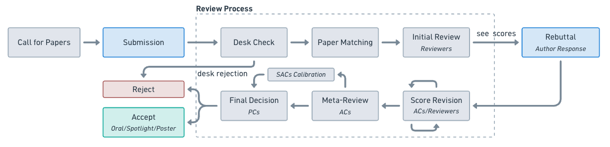

# Module 4 — Review Process

- can often feel first time: what is this?!

- review process

- actual examples of reviews pulled from Open Review as case studies

{#review-process width=100% fig-align="center"}

::: {.callout-note title="Tip!"}
Don't get discouraged by a rejection. Reviews = feedback = useful for next one. Can resubmit work to next conference. Often stochastic, i.e. very much dependent on the reviewers you get (how thourough they are, if they understand what you did, etc.).
:::

::: {.callout-note title="Tip!"}
Open-review allows you to see the reviews of other's papers. A great way to see what reviews actually looks like. learn the type of comments and notes reviewers often give, anticipate that.
:::